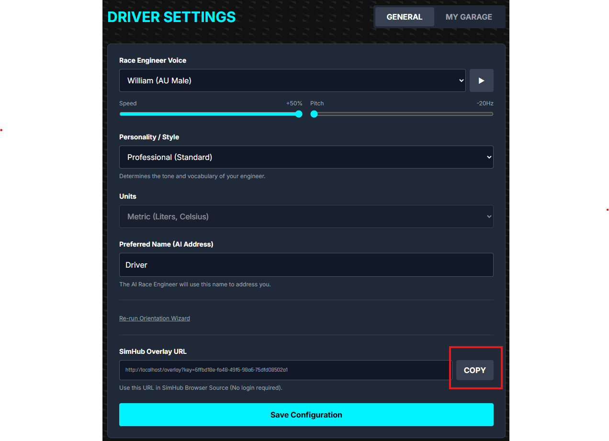
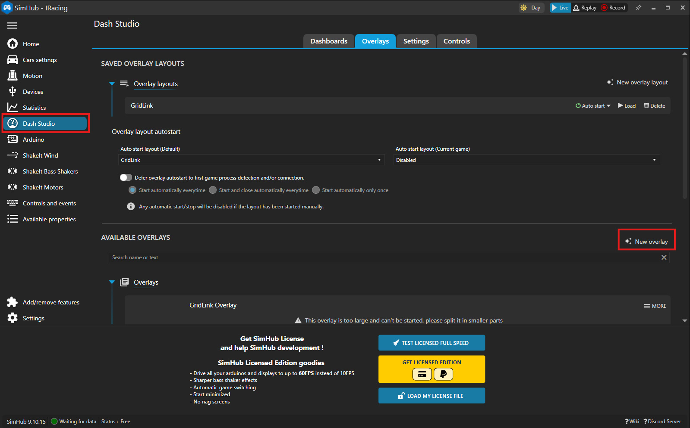
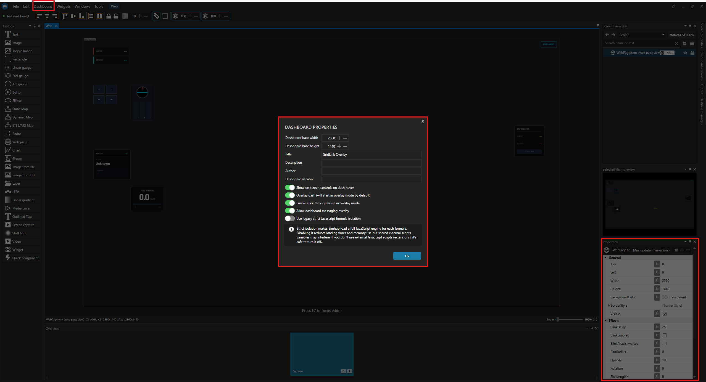

# Setting up GridLink Overlay in SimHub

GridLink provides a low-latency Heads Up Display (HUD) overlay that you can easily integrate into SimHub. This allows you to have your pit strategy, fuel calculations, and AI insights visible directly over your sim racing game.

## Prerequisites

- [SimHub](https://www.simhubdash.com/) installed and running.
- **GridLink** running and accessible (usually at `http://localhost:8000`).

## Step 1: Get your Overlay URL

1.  Open **GridLink** in your browser (`http://localhost:8000`).
2.  Navigate to **Settings** (Gear Icon on the left).
3.  Click on the **General** tab.
4.  Scroll down to the **SimHub Overlay URL** section.
5.  Click the **COPY** button to copy your unique overlay URL to your clipboard.

## Step 2: Create a Browser Overlay in SimHub

1.  Open **SimHub**.
2.  Go to **Dash Studio** from the left menu.
3.  Click on the **Overlays** tab at the top.
4.  Click **New Overlay**.
    - Give it a name, e.g., "GridLink HUD".
    - Click **OK**.

## Step 3: Add the Web Browser Source

1.  The Dash Editor will open.
2.  In the right-hand **Toolbox**, search for **"Web Page"** (or look under "Standard Components" -> "Others").
3.  Drag the **Web Page** component onto the canvas.
4.  With the Web Page component selected, look at the **Properties** panel on the right.
5.  Find the **Url** field.
6.  **Paste** the GridLink URL you copied in Step 1.

## Step 4: Finalize and Test

1.  Resize the Web Page component to fill the canvas (or your desired size). Recommended resolution: **1920x1080** (or match your monitor).
2.  Tick **"Transparent Background"** in the Web Page properties if available (GridLink handles transparency, but SimHub needs to allow it).
3.  Click **Save** in the top left.
4.  Click **"Test Dashboard"** to see it in action.

## Step 5: Arrange on Your Screen

1.  Back in the **Overlays** list in SimHub, find your new "GridLink HUD".
2.  Click **"New Layout"** or ensure it is added to your active layout.
3.  Click **"Edit Layout"** to manually position it on your screen, placing it in the top left and dragging it out to the size of your monitor.
4.  Start your game! The overlay will appear automatically.

